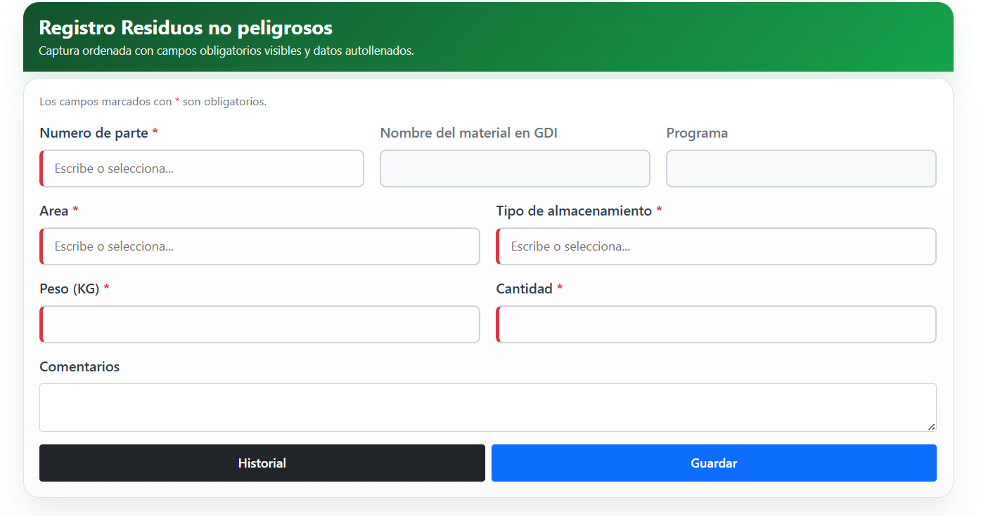
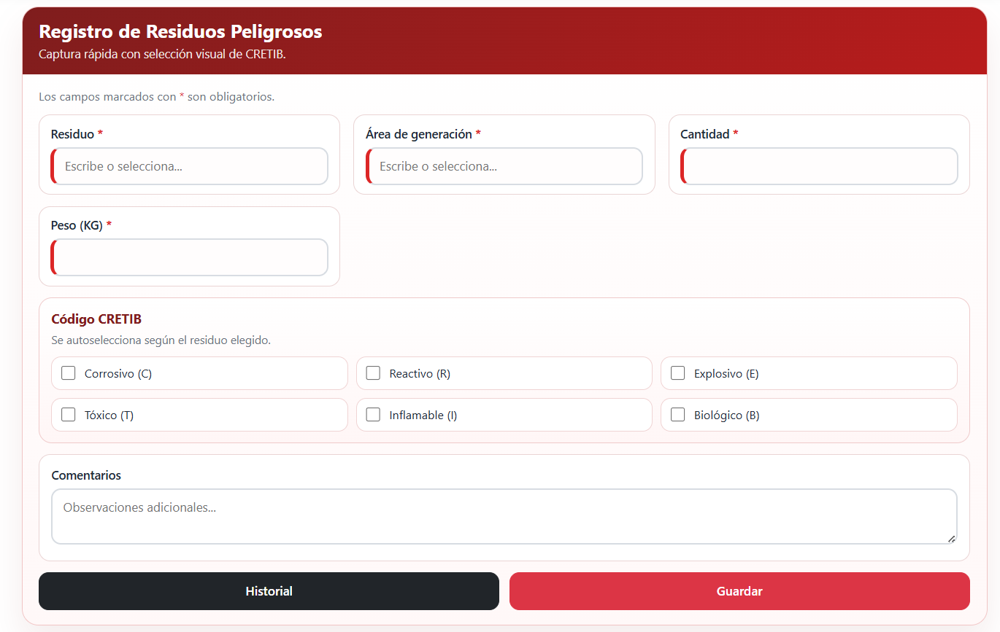
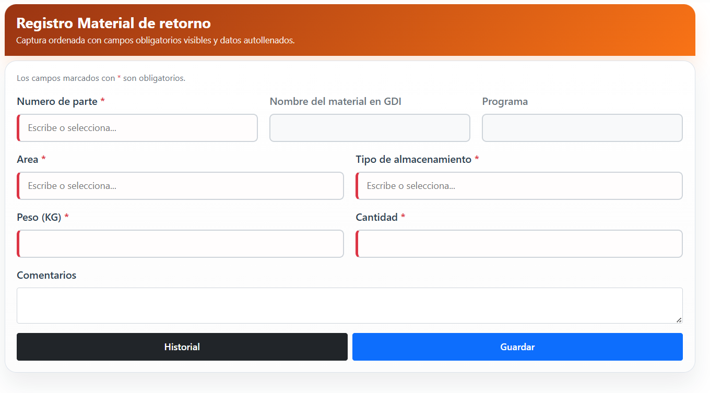
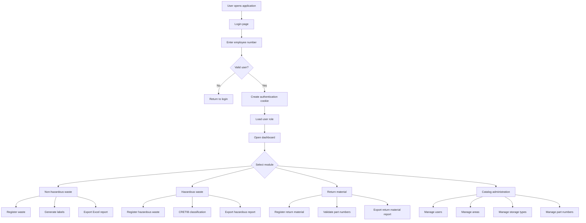

# SGA — Waste Management Platform

Web application developed with **ASP.NET Core MVC (.NET 8)** for managing hazardous waste, non-hazardous waste, return materials, and environmental traceability processes inside manufacturing environments.

---

## Overview

`SGA` is an industrial waste management platform designed to support operational and environmental processes inside manufacturing plants.

The system centralizes waste registration, material tracking, catalog administration, label generation, and Excel reporting while controlling access through role-based authentication.

The platform integrates directly with SQL Server and provides operational modules used by administrators, supervisors, and production personnel.

---

## Technologies

- `.NET 8`
- `ASP.NET Core MVC`
- `Entity Framework Core`
- `SQL Server`
- `ClosedXML`
- `Bootstrap`
- `jQuery`
- `DataTables`

---

## Main Features

### Waste Management

- Non-hazardous waste registration
- Hazardous waste registration
- Waste history tracking
- Environmental traceability
- Multi-field filtering and date range search
- Label printing directly from the browser

---

### Return Material Module

- Return material registration
- Return material tracking
- Part number validation
- Dedicated Excel export template
- Manufacturing material flow visibility

---

### Catalog Administration

Users can manage:

- Users
- Areas
- Storage types
- Part numbers
- Hazardous waste catalogs
- Hazardous generation areas

---

### Reporting and Exporting

- Excel report generation using `ClosedXML`
- Predefined templates stored in `wwwroot`
- Filtered exports by module
- Operational reporting for environmental control

---

### Authentication and Authorization

- Employee number login
- Cookie-based authentication
- Role-based access control
- Module visibility based on user role

---

## Screenshots

### Home


---

### Non-Hazardous Waste Registration



---

### Hazardous Waste Registration



---

### Return Material Registration



---

## User Roles

| Role | Access |
|---|---|
| `Administrator` | Full system access and user administration |
| `Supervisor` | Operational access to main modules |
| `User` | Limited access to assigned workflows |

---

## Application Architecture

The application follows a layered MVC architecture using Entity Framework Core and shared service classes.

```text
SGA/
|-- Controllers/        MVC controllers
|-- Data/               EF Core DbContext configuration
|-- Models/             Entity models
|-- Services/           Shared business services
|-- Views/              Razor views
|-- wwwroot/            Static resources and Excel templates
|-- Database/           SQL scripts and database resources
|-- Program.cs          Application startup configuration
```

---

## System Flow Diagram



---

## Main Modules

### Non-Hazardous Waste

This module allows users to register, edit, search, export, and print labels for non-hazardous waste records.

Main capabilities:

- Waste record creation
- Historical tracking
- Area validation
- Storage type validation
- Part number validation
- Excel export
- Label printing

---

### Hazardous Waste

This module supports hazardous waste registration and environmental classification workflows.

Main capabilities:

- Hazardous waste registration
- Hazardous waste catalog selection
- Generation area tracking
- CRETIB classification support
- Excel export
- Label printing

---

### Return Material

This module is focused on tracking manufacturing materials that are returned or reused within the operation.

Main capabilities:

- Return material registration
- Part number filtering
- Return material history
- Dedicated Excel export
- Traceability support

---

### Catalogs

Administrative modules used to maintain operational master data.

Catalog modules include:

- Users
- Areas
- Storage types
- Part numbers
- Hazardous waste types
- Hazardous generation areas

---

## Database Integration

The platform integrates with SQL Server and uses Entity Framework Core for data access.

Main entities include:

- `Users`
- `Area`
- `StorageType`
- `PartNumber`
- `NonHazardous`
- `HazardousArea`
- `HazardousWaste`
- `HazardousWasteManifest`
- `HazardousWaste_Cretib`
- `Cretib`

---

## Excel Templates

The application uses predefined Excel templates for report generation:

- `Bitacora.xlsx`
- `BitacoraResiduosPeligrosos.xlsx`
- `BitacoraMaterialRetorno.xlsx`

These templates support structured reporting for environmental and operational processes.

---

## Key Features

- Manufacturing-oriented environmental workflows
- Hazardous and non-hazardous waste tracking
- Return material management
- SQL Server integration
- Excel reporting support
- Label printing workflows
- Role-based authentication
- Catalog administration
- ASP.NET Core MVC architecture

---

## Project Purpose

This repository is part of my software engineering portfolio and represents a real-world environmental and operational management platform used inside manufacturing environments for waste tracking, material traceability, and industrial process administration.
